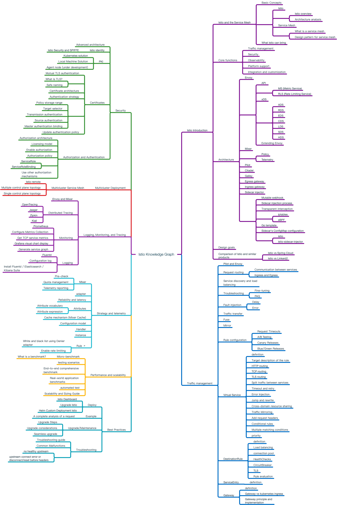

# Istio Knowledge Map

The [Istio](https://istio.io) knowledge map(Istio Knowledge Graph) is an open source project of [Istio Knowledge Map Working Group](https://github.com/orgs/servicemesher/teams/istio-knowledge-map-wg/members), it is a division of the [ServiceMesher](http://www.servicemesher.com) community that aims to enhance Service Mesh's theoretical learning and drive Service Mesh technology.

## Istio Knowledge Graph Reading

Istio Knowledge Graph is available in the following formats, (click the link below to view)：

- [Markdown](istio-knowledge-map.md)
- [MindNode](mindnode)
- [PDF](pdf/istio-knowledge-map.pdf)
- [PNG](png/istio-knowledge-map.png)

## Contributing

Istio Knowledge Graph v0.1 in [Google docs](https://docs.google.com/document/d/1nMAC9ZNH3NggQ_79vmdyog_2KtATKFofqP9f9K0rr7M/edit?ts=5c6ac5b7#heading=h.2nl61kfhbfx8) On collaborative editing, please refer to [Contribution Guide](CONTRIBUTING.md).

## Credits

Thanks to everyone at the Istio Knowledge Graph Working Group, and special thanks to the following contributors:

- [dreadbird](https://github.com/dreadbird)
- [haiker2011](https://github.com/haiker2011)
- [icyxp](https://github.com/icyxp)
- [junxy](https://github.com/junxy)
- [kongbo1987](https://github.com/kongbo1987)
- [mgxian](https://github.com/mgxian)
- [nicklv](https://github.com/nicklv)
- [sataqiu](https://github.com/sataqiu)
- [rootsongjc](https://github.com/rootsongjc)
- [wujunze](https://github.com/wujunze)
- [xianyuluo](https://github.com/xianyuluo)

# About the Istio Knowledge Graph Working Group

[Istio Knowledge Graph Working Group](https://github.com/orgs/servicemesher/teams/istio-knowledge-map-working-group/members) Yes

[ServiceMesher Community](http://www.servicemesher.com) A branch of the company, which aims to strengthen the theoretical learning of Service Mesh through collaboration, common learning, and common progress, while promoting the promotion of Service Mesh technology.

# Privilege Description

This document will be publicly accessible on the Internet.

ServiceMesher in GitHub
[istio-knowledge-map](https://github.com/orgs/servicemesher/teams/istio-knowledge-map-working-group/members) Members of the team will have permission to edit.

*** The final interpretation right of this document belongs to [ServiceMesher Community] (http://www.servicemesher.com). ***

